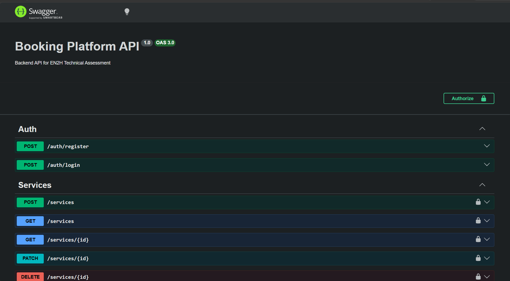

# Booking Platform API

## Overview

Booking Platform API is a NestJS backend service for managing services, bookings, and authenticated users. It supports REST endpoints for authentication, service management, and booking creation.

## Requirements

- Node.js 18+
- npm
- PostgreSQL database

## Setup

```bash
npm install
```

Create a `.env` file with your database and JWT settings. Example values:

```env
DATABASE_HOST=localhost
DATABASE_PORT=5432
DATABASE_USER=postgres
DATABASE_PASSWORD=your_password
DATABASE_NAME=booking_platform
JWT_SECRET=your_jwt_secret
JWT_EXPIRES_IN=3600s
```

## Run

```bash
npm run start:dev
```

Open the Swagger UI locally at:

- `http://localhost:3000/api`

When deployed on Render:

- API base URL: `https://booking-platform-api-ekfd.onrender.com/`
- Swagger UI: `https://booking-platform-api-ekfd.onrender.com/api`

## Screenshots



<p align="center">
  
  
</p>

## Available scripts

```bash
npm run build
npm run start
npm run start:dev
npm run start:prod
npm run test
npm run test:e2e
npm run test:cov
npm run lint
```

## API Endpoints

### Authentication

- `POST /auth/login` - Authenticate a user and receive a JWT token.

### Services

- `POST /services` - Create a new service (requires authentication).
- `GET /services` - List services.

### Bookings

- `POST /bookings` - Create a new booking (requires authentication).

## Authorization

Use the `Authorization` header with a Bearer token:

```http
Authorization: Bearer <token>
```

## Notes

- Swagger UI should preserve authorization between requests.
- Bookings may support legacy payload formats depending on the implementation.

## Project structure

- `src/main.ts` - App bootstrap and Swagger configuration
- `src/app.module.ts` - Root module
- `src/auth/` - Authentication and JWT strategy
- `src/services/` - Service management
- `src/bookings/` - Booking endpoints and DTOs
- `src/entities/` - TypeORM entities

## License

This project is private and unlicensed for public redistribution.
